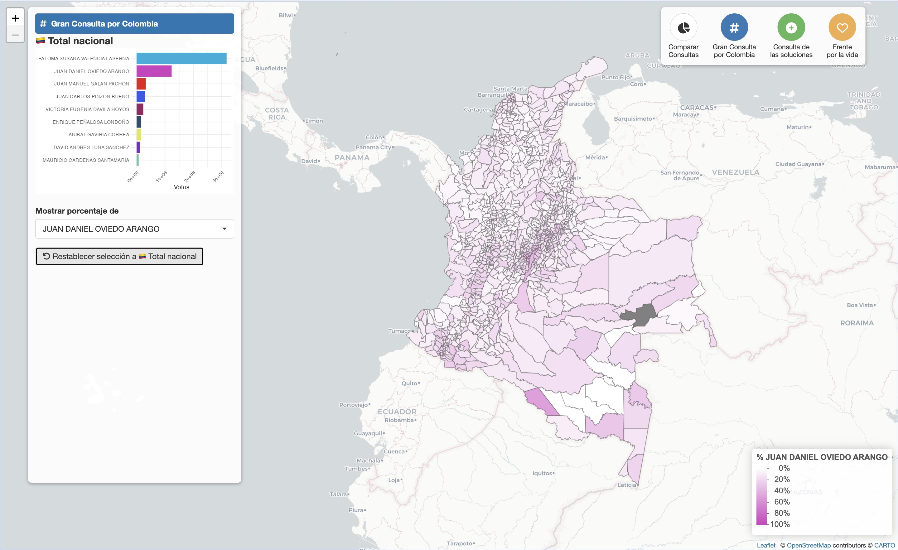

# Resultados Consultas Presidenciales Colombia 2026 por municipio

Este repositorio contiene los resultados por consultas presidenciales correspondiente al **informe 79 de preconteo** de la Registraduría Nacional del Estado Civil (99.86% de mesas informadas) de las elecciones de consultas a la Presidencia de Colombia (2026). Estos resultados **no** son datos definitivos y tienen un caracter divulgativo únicamente. Estos datos generalmente son distribuidos en formatos digitales (Archivos de excel o CSV) a medios de comunicación y organizaciones políticas, pero no son fácilmente accesibles para el público en general.

> De conformidad con el parágrafo 2 del artículo 2 de la Resolución No. 1706 de 2019 del CNE, los boletines expedidos por la Registraduría Nacional del Estado Civil, durante el denominado preconteo, no son de carácter vinculante y tienen mero carácter informativo, por lo que no pueden considerarse como documentos electorales que definan una elección.

**Tip**: Si unicamente quiere explorar los resultados de las elecciones en la [La Silla Vacía](https://www.lasillavacia.com/silla-nacional/las-tripas-de-las-elecciones-al-congreso-y-consultas-2026/) encuentra un visualisador con resultados de preconteo que incluye datos similares (No se informa el boletín).

## Instrucciones de uso

Este repositorio contiene un archivo CSV con los resultados de las tres consultas por municipio en los 32 departamentos de Colombia y los consulados. A diferencia de los datos de la Registraduría, este datase contiene un código por municipio que hace posible conectar los datos con otras bases de datos nacionales. Esto requirió armonizar los nombres de los municipios y los departamentos.

### Explicación 

- **mpio_cdpmp:** Código del Municipio de acuerdo al DANE (Esta es una addición que incluí para poder conectar la base de datos con otros datos. Los únicos lugares que no tiene código corresponde a los puesto en CONSULADOS.
- **dep_amdc:** Códio Departamental de acuerdo a la Registraduía
- **dep_nombre:** Código Departamental de acuerdo a la Registraduía
- **mun_amb:** Código Municipal de acuerdo a la Registraduría
- **mun_nombre:** Nombre del Municipio 
- **amb_code:** Código Municipal de acuerdo a la Registraduría (Equivalente a **mun_amb**)
- **dep_code:** Código Departamental (Similar a dep_amb)
- **mesas_instaladas:** Número de mesas instaladas en Municipio
- **mesas_escrutadas:** Número de mesas informadas al momento del pre-conteo (Informe 79)
- **votantes_potenciales:** Número de votantes habilitados para votar
- **votantes:** Total número de votantes del tarjeton de Consultas
- **no_marcados:** Votos no marcados
- **nulos:** Votos nulos
- **validos:** Votos válidos

Las siguientes columnas incluyen el número de votos por cada candidato de las 3 consultas. Los votos **NO** están separados por consultas.

### Candidatos

- **CONSULTA DE LAS SOLUCIONES: SALUD, SEGURIDAD Y EDUCACIÓN (CDLS)**
  - LEONARDO.HUMBERTO.HUERTA.GUTIERREZ
  - CLAUDIA.NAYIBE.LOPEZ.HERNANDEZ
- **LA GRAN CONSULTA POR COLOMBIA**
  - PALOMA.SUSANA.VALENCIA.LASERNA
  - JUAN.MANUEL.GALAN.PACHON
  - VICTORIA.EUGENIA.DAVILA.HOYOS
  - ENRIQUE.PEÑALOSA.LONDOÑO
  - JUAN.DANIEL.OVIEDO.ARANGO
  - MAURICIO.CARDENAS.SANTAMARIA
  - JUAN.CARLOS.PINZON.BUENO
  - DAVID.ANDRES.LUNA.SANCHEZ
  - ANIBAL.GAVIRIA.CORREA
- **FRENTE POR LA VIDA**
  - ROY.LEONARDO.BARRERAS.MONTEALEGRE
  - MARTHA.VIVIANA.BERNAL.AMAYA
  - HECTOR.ELIAS.PINEDA.SALAZAR
  - EDISON.LUCIO.TORRES.MORENO
  - DANIEL.QUINTERO.CALLE
 
### Ejemplos de uso

Utilizando Shiny (R) y el shapefile del [DANE (Versión MGN2025-Nivel Municipio)](https://geoportal.dane.gov.co/servicios/descarga-y-metadatos/datos-geoestadisticos/) es posible crear dashboards los datos de la Registraduría y bases de datos del DANE. Por ahora, para un proyecto personal, solo se realizó la visualización conectando los datos con los poligonos municipales.

# Licencia

 Resultados Consultas Presidenciales Colombia 2026 por <a xmlns:cc="http://creativecommons.org/ns#" href="https://github.com/SbastianGarzon" property="cc:attributionName" rel="cc:attributionURL">Sebastian Garzón</a> se distribuye bajo una <a rel="license" href="http://creativecommons.org/licenses/by-nc/4.0/">Licencia Creative Commons Atribución-NoComercial 4.0 Internacional</a>. Basada en una obra en <a xmlns:dct="http://purl.org/dc/terms/" href="https://resultados.registraduria.gov.co/" rel="dct:source">https://resultados.registraduria.gov.co</a>.

Atribución requerida, uso no comercial.
Repositorio con resultados de consultas a la Presidencia de Colombia (2026)
